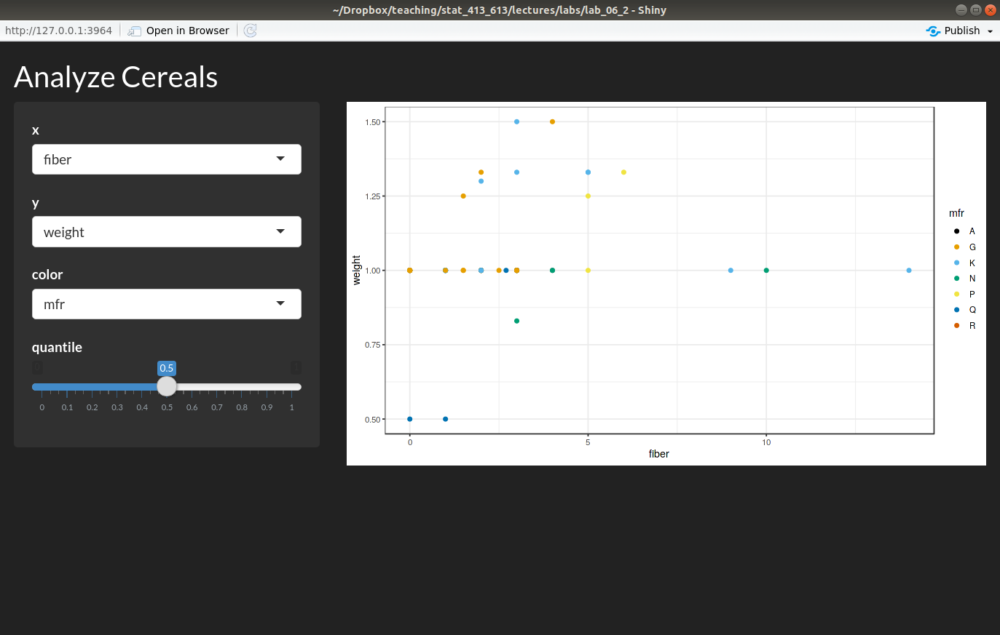
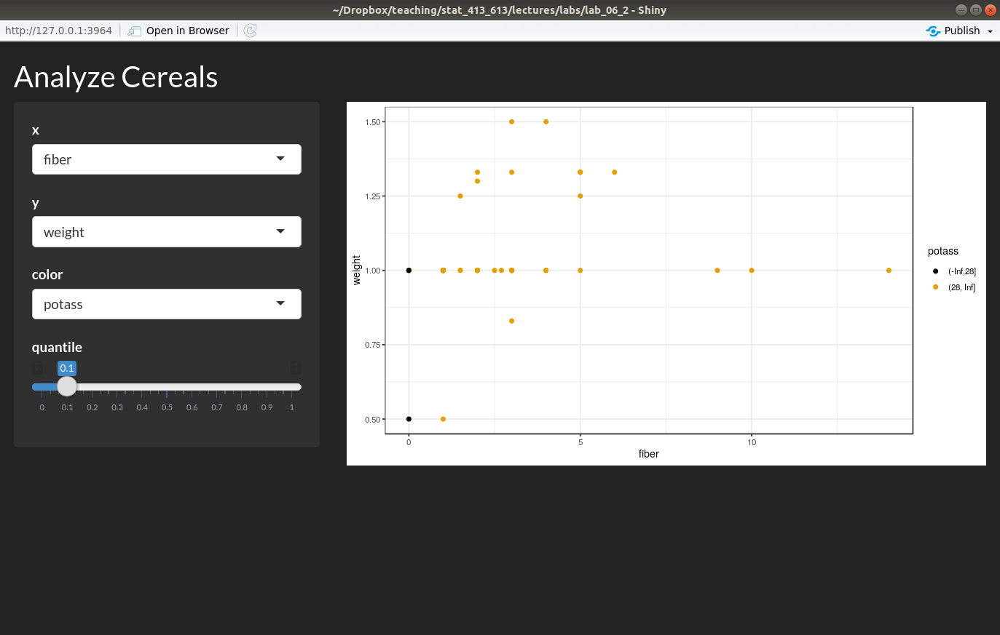
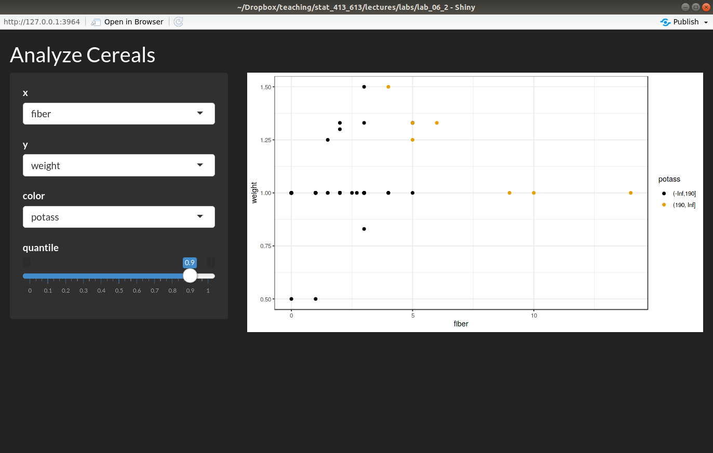

# Instructions

- Build a Shiny App to interactively explore the `cereals` data
  in the data folder.
- This app should plot two variables in a scatterplot, color-coding by a
  third variable. 
- If the color-coding variable is quantitative, the color-coding should be 
  binary (two colors) based on a quantile of the color-coding variable 
  (which is chosen by the user). E.g., if the selected quantile is 0.75 
  then all observations below the 0.75 quantile are color-coded one color, 
  and the remaining observations are color-coded the other color.
- If the color-coding variable is categorical, then you should do the 
  color-coding in the usual way.
- Use a sidebar layout and make your theme darkly.
- Your app should look this this:

    
    \ 
    
    \ 
    
    \ 
    
    \ 
  
